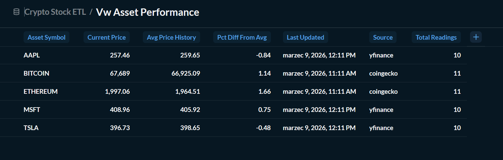
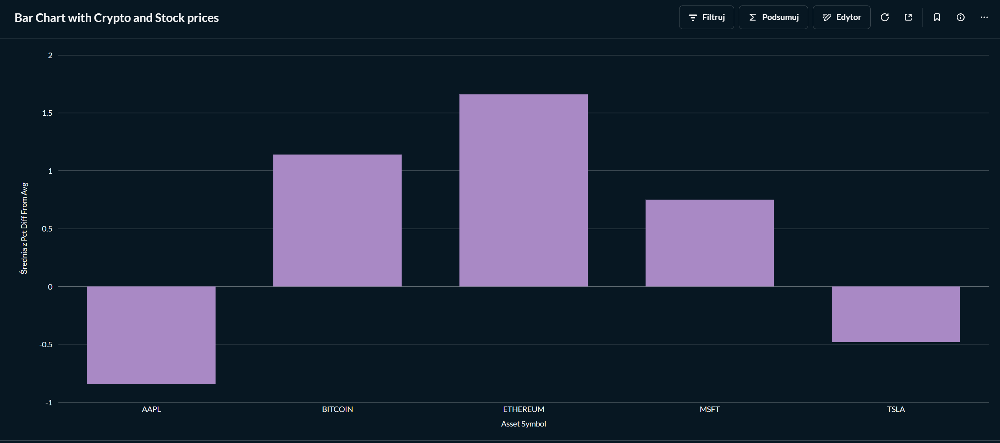

# Crypto & Stock Market ETL Pipeline

A professional-grade ETL (Extract, Transform, Load) pipeline that integrates real-time data from cryptocurrency and equity markets into a local Dockerized data warehouse.

## 🚀 System Architecture

The project implements a robust data processing lifecycle:

1. **Extract**: Automated fetching of raw JSON data from the **CoinGecko API** and **Yahoo Finance** (via `yfinance`).
2. **Transform**: Data cleaning, schema unification, and validation using **Pandas** to ensure high data quality.
3. **Load**: Secure data persistence into **PostgreSQL** using a **Staging & UPSERT** strategy to prevent duplicates and ensure data integrity.
4. **Archive**: Automated "Cold Storage" mechanism that moves processed files out of the landing zone to maintain system performance.
5. **Analyze**: An analytical layer powered by **SQL Views** and interactive **Metabase** dashboards for real-time monitoring.

---

## 🛠️ Technical Stack

* **Language**: Python 3.11+
* **Database**: PostgreSQL 15 (Containerized)
* **Libraries**: Pandas, SQLAlchemy (2.0+), pg8000, Dotenv, PyYAML
* **Visualization**: Metabase (Docker)
* **Infrastructure**: Docker & Docker Compose

---

## 📋 Configuration & Setup

### 1. Clone the Repository

```bash
git clone https://github.com/your-username/crypto-stock-etl.git
cd crypto-stock-etl

```

### 2. Environment Setup

Create a `.env` file in the root directory:

```env
DB_HOST=127.0.0.1
DB_PORT=5435
DB_NAME=crypto_stock_db
DB_USER=postgres
DB_PASSWORD=your_password

```
You can use .env.example as a reference

### 3. Install Dependencies

```bash
python -m venv etl-env
# Windows
.\etl-env\Scripts\activate
# Linux/Mac
source etl-env/bin/activate

pip install -r requirements.txt

```

### 4. Spin up Infrastructure

```bash
docker-compose up -d

```

---

## 🏃 Running the Pipeline

To execute the full ETL process, simply run:

```bash
python main.py

```

Upon completion, processed JSON files will be moved to `data/archive/`, and the PostgreSQL database will be updated with the latest market figures.

## 📊 Analytics & BI

Access your data insights via **Metabase** at `http://localhost:3000`. The project includes a pre-configured SQL view `vw_asset_performance` which calculates:

* **Current Market Price**: The most recent data point per asset.
* **Historical Average**: Moving average based on accumulated records.
* **Performance Delta**: Percentage difference between the current price and historical average.

Data Visualization:



---

### 📁 Project Structure

* `src/extractors/` - API integration logic.
* `src/transformers/` - Pandas-based data cleaning.
* `src/loaders/` - PostgreSQL UPSERT and Staging logic.
* `data/raw/` - Landing zone for new JSON data.
* `data/archive/` - Cold storage for processed history.
* `sql/` - DDL scripts and analytical views.